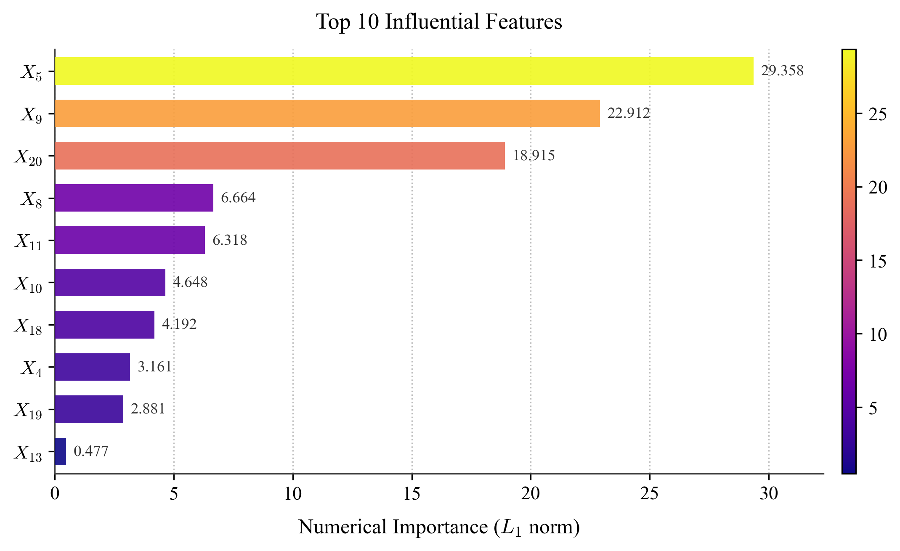
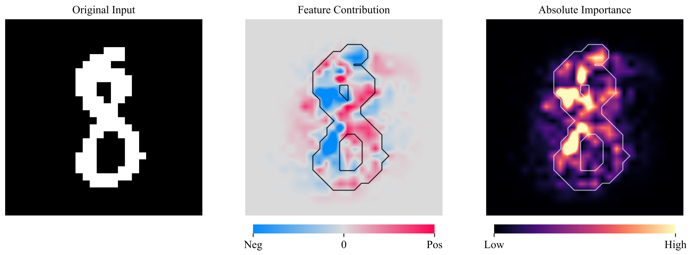

# Exact Functional ANOVA Decomposition for Categorical Inputs (_ICML 2026, Oral_)

Code of the [paper](https://arxiv.org/pdf/2603.02673) by Baptiste Ferrere, Nicolas Bousquet, Fabrice Gamboa, Jean-Michel Loubes and Joseph Muré.

## Abstract

Functional ANOVA offers a principled framework
for interpretability by decomposing a model’s prediction into main effects and higher-order interactions. For independent features, this decomposition is well-defined, strongly linked with SHAP
values, and serves as a cornerstone of additive
explainability. However, the lack of an explicit
closed-form expression for general dependent distributions has forced practitioners to rely on costly
sampling-based approximations. We completely
resolve this limitation for categorical inputs. By
bridging functional analysis with the extension
of discrete Fourier analysis, we derive a closed-form decomposition without any assumption. Our
formulation is computationally very efficient. It
seamlessly recovers the classical independent case
and extends to arbitrary dependence structures,
including distributions with non-rectangular support. Furthermore, leveraging the intrinsic link
between SHAP and ANOVA under independence,
our framework yields a natural generalization of
SHAP values for the general categorical setting.

## Inverse Likelihood Mechanism

$$
\phi_A^{(\mathbf{z})}(\mathbf{x}) := \frac{ \prod\limits_{i \in A} \left( \mathbf{1}\left\lbrace \mathbf{x}_i = \mathbf{z}_i \right\rbrace - \mathbf{1}\left\lbrace \mathbf{x}_i = N_i - 1 \right\rbrace \right) }{ p_A(\mathbf{x}_A) }
$$

## Illustration 1 (_Mushrooms_ dataset)

## Illustration 2 (_Binarized MNIST_ dataset)

